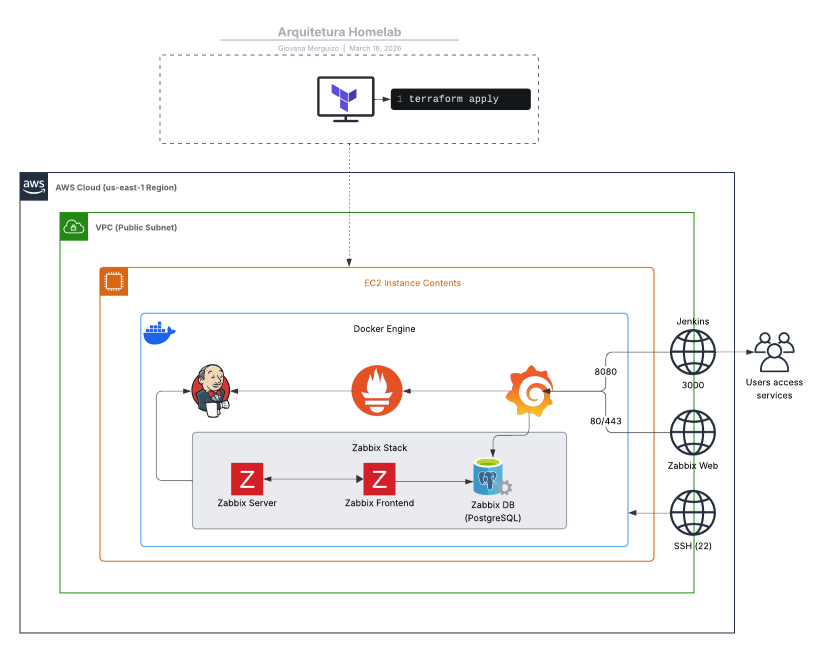

# Homelab
> Configurando um Homelab do zero. Tudo que eu tenho é internet, um pc e um sonho. - Merguizo Gi, 2026

## 🗂 Estrutura de Pastas
- `/grafana_config`: Arquivos de configuração do grafana.
- `/prometheus`: Arquivos de configuração do prometheus.
- `/docs`: Documentação e imagens de referência.
- `/scripts`: Scripts úteis. Ex.: instalação de pacotes e instalação do docker

## 🛑 Andamento do Projeto
- [x] AWS EC2
- [x] Linux (Ubuntu)
- [x] Docker
- [x] Grafana
- [x] Zabbix
- [x] Jenkins
- [ ] Automatizar com Terraform

### 🐧 Configuração de uma instância EC2
> Vamos configurar uma máquina Ubuntu _(freetier)_

1. Abrir o EC2 na AWS e executar uma nova instância
2. Configurações:
   - **Imagem de máquina da Amazon (AMI):** Ubuntu Server 24.04 LTS (HVM), SSD Volume Type _(freetier)_
   - **Arquitetura:** 64 bits (x86)
   - **Tipo de instância:** t3.micro _(freetier)_
   - **Par de chaves:** Criar novo par de chaves (`rsa` / `.pem`)
   - **Configurações de rede:** Criar grupo de segurança
   - **Armazenamento:** 1 x 8GiB gp3

### 🐋 Instalação Docker
- Conectar na instância configurada
- Clonar o repositório`: `git clone https://github.com/GiMerguizo/homelab.git`
- Navegar até o diretório `scripts` do repositporio: `cd homelab/scripts`
- Atualizar a permissão do script: `chmod 755 install-docker.sh` ou `chmod +x install-docker.sh`
- Rodar o script (como superusuário): `./install-docker.sh`

### 🛠️ Docker compose
O docker compose contém as configurações necessárias para a implementação do **zabbix**, **grafana** e **prometheus** rodando em docker.
- Configuração: PostgresDB, Nginx, Zabbix 7.0, Grafana, Prometheus e Jenkins
- Rodando:
```bash
docker compose up -d 
# ou
docker-compose up -d
```

Caso dê erro no grafana:
- Verificar os logs
```bash
docker logs grafana
```
- Se for o erro for: `Permission denied`, atualize a permissão do diretório:
```bash
docker compose down -v
sudo chown -R 472:472 ./grafana_data
docker compose up -d
```

#### 🚪 Portas
- **Jenkins:** [http://localhost:8080](http://localhost:8080)
- **Zabbix:** [http://localhost:80](http://localhost:8080)
- **Prometheus:** [http://localhost:9090](http://localhost:9090)
- **Grafana:** [http://localhost:3000](http://localhost:3000)
  - Login: `admin`
  - Senha: `admin`

## 🏗 Arquitetura do Projeto


## 📝 Referências
### Outros Repositórios
- [Monitoramento do Jenkins com Grafana + Prometheus](https://github.com/GiMerguizo/integracao-jenkins-grafana)
- [Desafio Técnico - Cubos DevOps](https://github.com/GiMerguizo/desafio-tecnico-cubos-devops/tree/main)
- [Monitoração Zabbix + Grafana](https://github.com/GiMerguizo/monitoramento-zabbix-grafana)
- [Integração Jenkins + Grafana](https://github.com/GiMerguizo/integracao-jenkins-grafana)